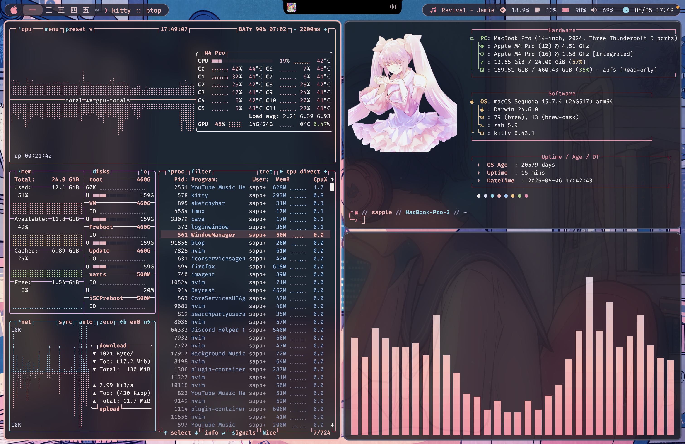
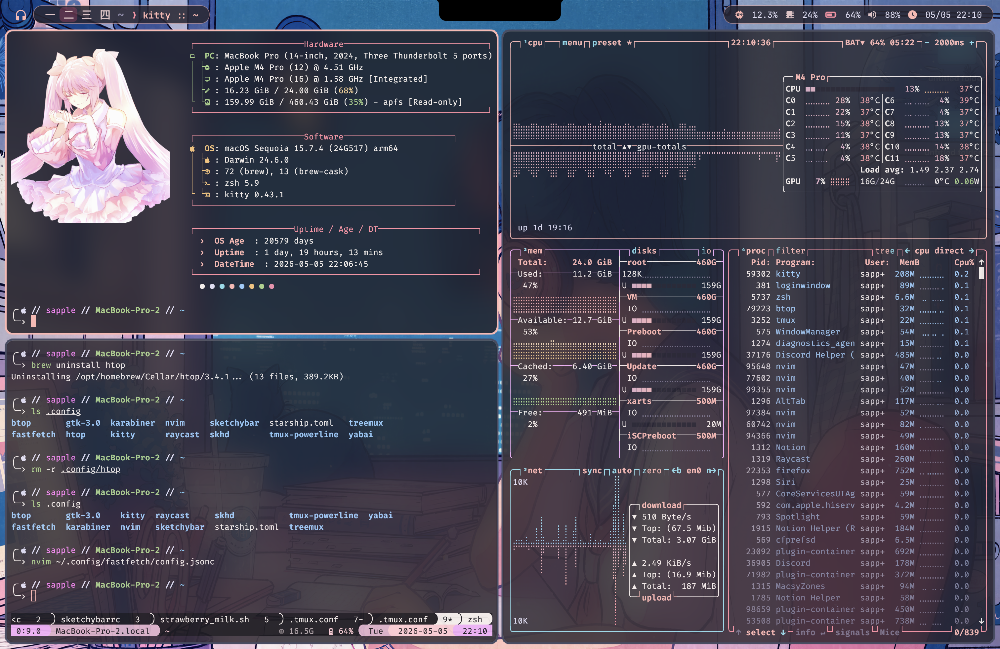

# dotfiles

My custom dotfiles, a pastel pink themed rice configuration. Might have branches that have different themes. Also most of this was AI generated since this was my first rice.

## Files

- **OS**: MacOS
- **Status Bar**: Sketchy Bar
- **Terminal**: Kitty (Tmux & Starship)
- **Shell**: Zsh
- **Editor**: LazyVim
- **Tile Manager**: Yabai

## Screenshots

## > [!CAUTION]
> Make sure to remove the top menu. There's the setting in System Settings that hides it unless hovered.
> There should be a command in `yabairc` that should hide it.
>
> `yabai -m config menubar_opacity 0.0`
>
> If that doesn't work, you have to make sure you follow yabai's installation that include disabling SIP.

## Installation

Clone this repo.

The `install.sh` script uses `stow` to link my configs to their respective `.configs`. 

After running it, if you want to edit the configs, you'd have to edit the files in the repo.

Have fun~! <3
